# MKPhotobox

**Die Fotobox, die einem ganzen Abend gewachsen ist.** Gäste tippen auf den
Bildschirm, posen, bekommen ihr Foto gedruckt und aufs Handy — und du musst nichts
tun außer den Strom einzuschalten.

Modulare Photo-Booth-Software für Veranstaltungen: **Python (FastAPI)** im Rücken,
**Vanilla-JS**-Oberfläche im Vordergrund, **komplett offline lauffähig**, bedienbar
vollständig über den Browser.

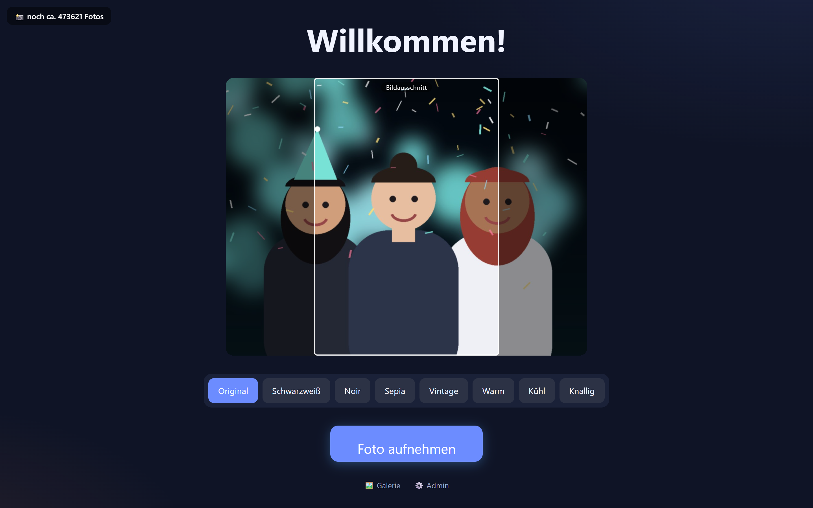

---

## Warum diese Box

- **Läuft ohne Internet.** WLAN-Ausfall auf der Hochzeit? Egal. Aufnehmen,
  drucken, Galerie, USB-Export — alles lokal. Online-Dienste sind Zugabe, nie
  Voraussetzung.
- **Ein Rechner, keine Cloud-Abos.** Ein gebrauchter Mini-PC reicht. Keine
  Lizenzschlüssel, keine Bilder auf fremden Servern.
- **Für Vermieter gebaut.** Ein eingeschränkter *Mieter*-Login lässt Kunden ihre
  Veranstaltung selbst einrichten, ohne an Netzwerk, Zahlung oder System zu kommen.
- **Modular.** Kamera, Auslöser, Ausgabe und Bezahlung sind austauschbare Module.
  DSLR oder Webcam, Touch oder Klingelknopf, Druck oder QR — kombinierbar.
- **Erklärt sich selbst.** Das komplette Bedienhandbuch steckt in der Oberfläche
  unter **Hilfe** — es liegt immer auf der Box und passt zur installierten Version.

> Zielgerät: x86_64-Mini-PC mit Ubuntu 24.04 (läuft grundsätzlich auch auf
> Raspberry Pi OS / anderen Linuxen).

**Wo steht was:** Diese Seite beschreibt, was die Box kann und wie ein Abend damit
abläuft. Wer sie **aufsetzen oder betreiben** will, findet alles Technische in der
[Installations- und Betriebsanleitung](docs/INSTALLATION.md).

---

## So läuft ein Abend

**1 · Look wählen, dann posieren.** Schwarzweiß, Noir, Sepia, Vintage, warm, kühl
oder knallig. Die Live-Vorschau zeigt den Look sofort — man sieht vorher, was
hinterher herauskommt.

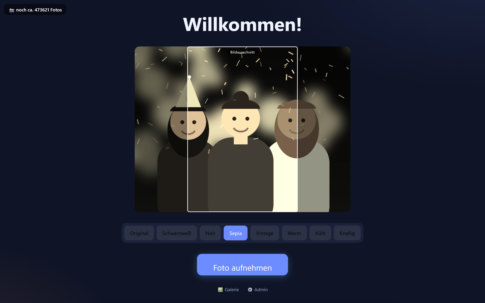

**2 · Layout wählen.** Einzelfoto oder Mehrbild-Streifen — was du für die
Veranstaltung freigegeben hast. Jede Karte zeigt das **fertig gerenderte Layout**
mit Rahmen, Text und durchnummerierten Plätzen, nicht bloß ein Symbol.

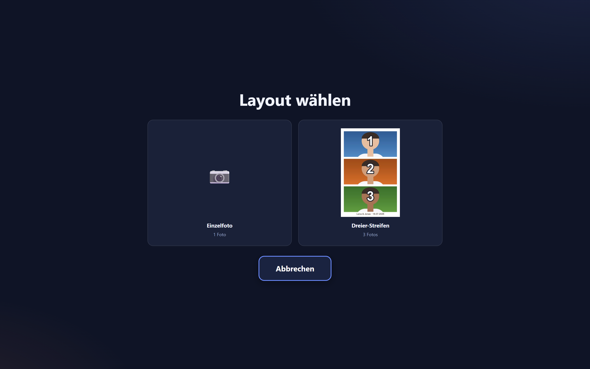

**3 · Countdown.** Mit Piepton, Auslöse-Klick und Weißblende. Der Auslöse-Vorlauf
gleicht die Verzögerung der Kamera aus, damit das Foto exakt bei „0" entsteht.

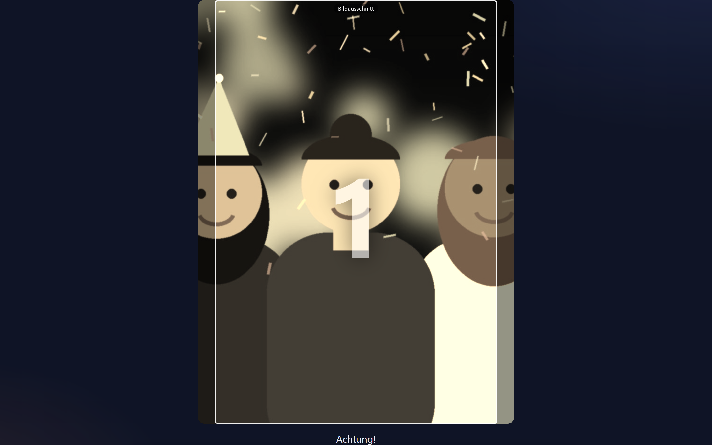

**4 · Ansehen — und verewigen.** Nicht gefallen? *Nochmal*. Sonst: mit dem Finger
aufs Foto malen und ein Grußwort dazuschreiben. Das digitale Gästebuch.

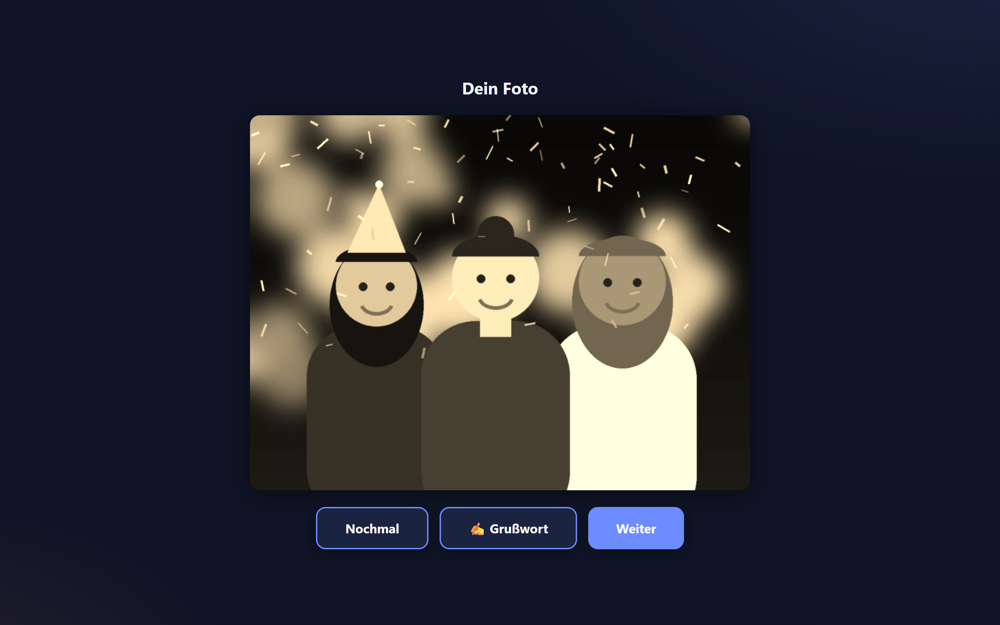

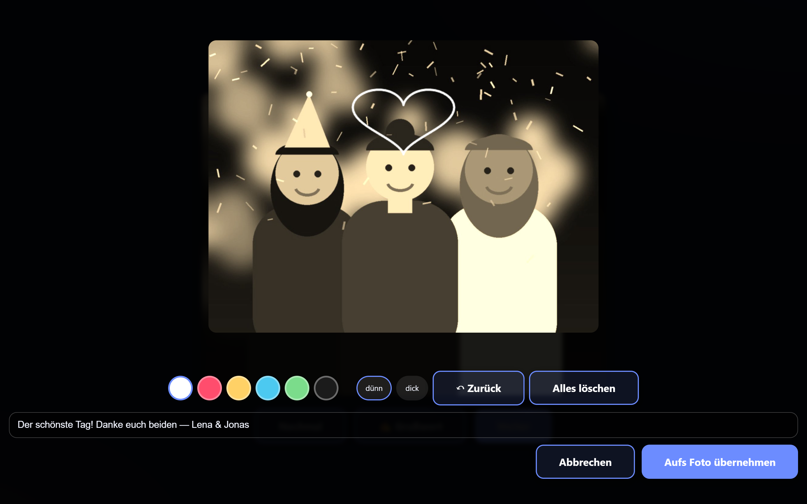

**5 · Mitnehmen.** Drucken, per QR aufs Handy, E-Mail, Bluetooth, USB-Stick oder
auf CD/DVD gebrannt. Und alles landet in der Galerie.

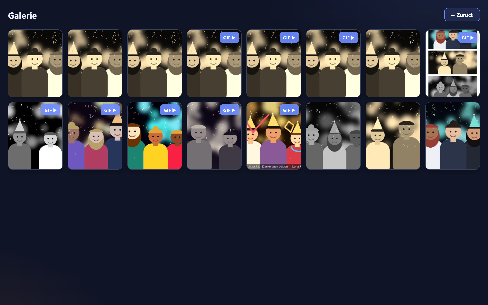

---

## Was die Box kann

**Aufnehmen**
- DSLR über gPhoto2 (Linux) oder digiCamControl (Windows), USB-Webcam über
  OpenCV, oder die Kamera des Browsers — auch getrennt für Vorschau und Aufnahme
  (Webcam zeigt live, DSLR schießt).
- Auslöser: Touch, GPIO-Knopf, Tastatur, seriell, Bluetooth oder Klatschen.
- Drehen und Spiegeln für schräg montierte Kameras. Getrennt davon der
  **Spiegel-Effekt**: Gäste sehen sich wie im Spiegel und posieren richtig herum,
  das gespeicherte Foto bleibt seitenrichtig — Schrift und Logos bleiben lesbar.
- Hintergrund ersetzen per Greenscreen oder KI-Freisteller.
- **Animiertes GIF** aus den Sekunden vor dem Auslösen, wahlweise als
  **Boomerang** (vorwärts und wieder rückwärts).

**Gestalten**
- Vorlagen-Editor mit frei platzierbaren Foto-Slots, Rahmen, Logos und Text
  (Schriftart, Kontur, Drehung) — direkt auf dem Touchscreen bedienbar.
- Ausgabe-Formate (10×15, A6, A4 …) bestimmen die Leinwandgröße der Vorlage.
- Jede Vorlage bekommt automatisch ein **Vorschaubild** — im Booth auf den
  Auswahlkarten und in der Vorlagenliste. Es wird beim Speichern erzeugt und
  erneuert sich von selbst, sobald du die Vorlage änderst.
- Ein Foto darf in mehreren Slots auftauchen: zwei Aufnahmen füllen ein
  Drei-Bilder-Layout.

**Ausgeben**
- Druck über CUPS mit **Papierstand-Überwachung** — die Box warnt und stoppt,
  bevor mitten in der Nacht das Papier ausgeht.
- QR-Code aufs Gäste-Handy, E-Mail oder Bluetooth — beim Bluetooth-Versand sucht
  die Box Geräte in der Nähe, der Gast tippt seins an; vorheriges Koppeln ist
  nicht nötig. Umgekehrt nimmt die Box auch Dateien per Bluetooth entgegen.
- USB-Stick-Export und CD/DVD-Brennen für die Übergabe an den Veranstalter.
- Online-Galerie: spiegelt jedes neue Foto auf einen eigenen Server.

**Verwalten**
- Mehrere Veranstaltungen, jede mit eigenen Vorlagen und eigenem Standort.
- **Metadaten**: Veranstaltungsname, Ort, GPS-Koordinaten, Aufnahmezeit und
  Kameramodell landen in den EXIF-Daten jedes Fotos, jeder Collage und jedes
  Thumbnails; GIFs bekommen dieselben Angaben als Kommentar. Die Bilddaten selbst
  bleiben dabei unangetastet — es wird nichts neu komprimiert.
- Bezahlung per SumUp (QR oder Terminal) oder Münzprüfer, wenn die Box Geld
  verdienen soll.
- Telegram-Benachrichtigungen: Hilfe-Knopf im Booth und Warnung bei leerem Drucker.
- Eingebauter **Selbsttest** prüft Kamera, Datenbank, Drucker, Auslöser und
  Bildverarbeitung auf Knopfdruck.

---

## Die Steuerung

Alles über den Browser — vom Handy, Tablet oder direkt am Touchscreen der Box.

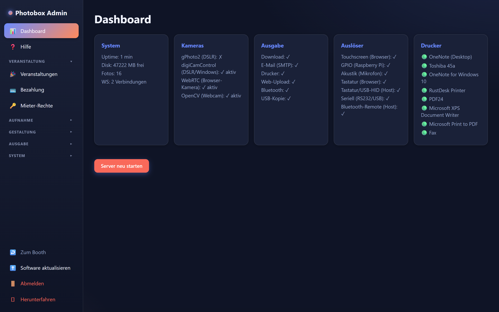

Die Kamera-Einstellungen mit Drehung, Spiegelung und dem Spiegel-Effekt:

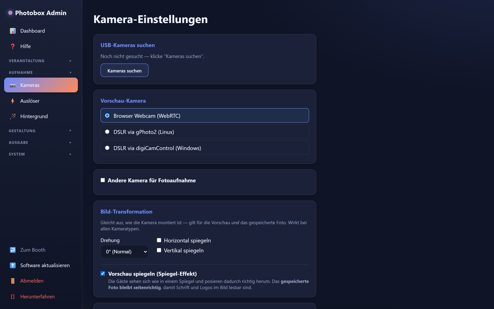

Veranstaltungen — inklusive Standort, der in die Fotos geschrieben wird:

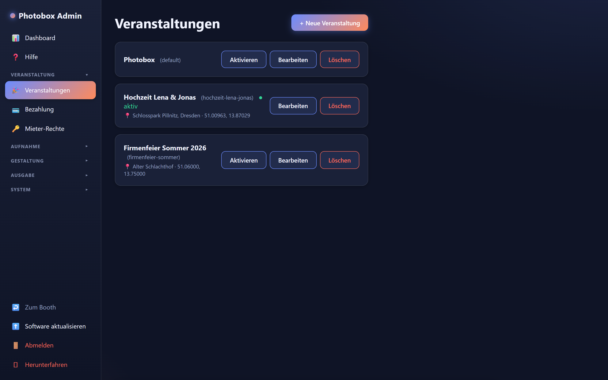

Und das Handbuch, das immer auf der Box liegt:

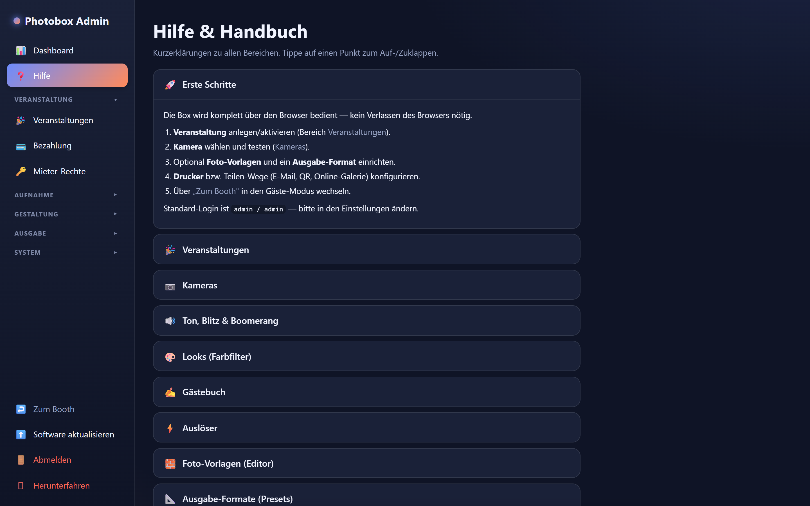

---

## Installation

Die Box läuft auf einem Mini-PC mit Linux. Aufsetzen, Aktualisieren, Fernzugang
und die üblichen Stolpersteine stehen in der
**[Installations- und Betriebsanleitung](docs/INSTALLATION.md)**.

Kurzfassung für Ungeduldige:

```bash
git clone https://github.com/mkrasselt1/mkphotobox.git
cd mkphotobox
sudo ./scripts/setup.sh
```

Danach läuft die Box auf Port **8080**, Login `admin` / `admin`.

---

## Zu den Bildern in diesem README

Die Screenshots zeigen die echte Oberfläche. Die abgebildeten „Gäste" sind
allerdings keine Fotos, sondern mit Pillow gezeichnete Illustrationen aus
[`docs/media/demo/`](docs/media/demo/) — sie stammen aus diesem Repository, zeigen
keine realen Personen und sind damit uneingeschränkt frei verwendbar.

---

## Lizenz

TBD.
